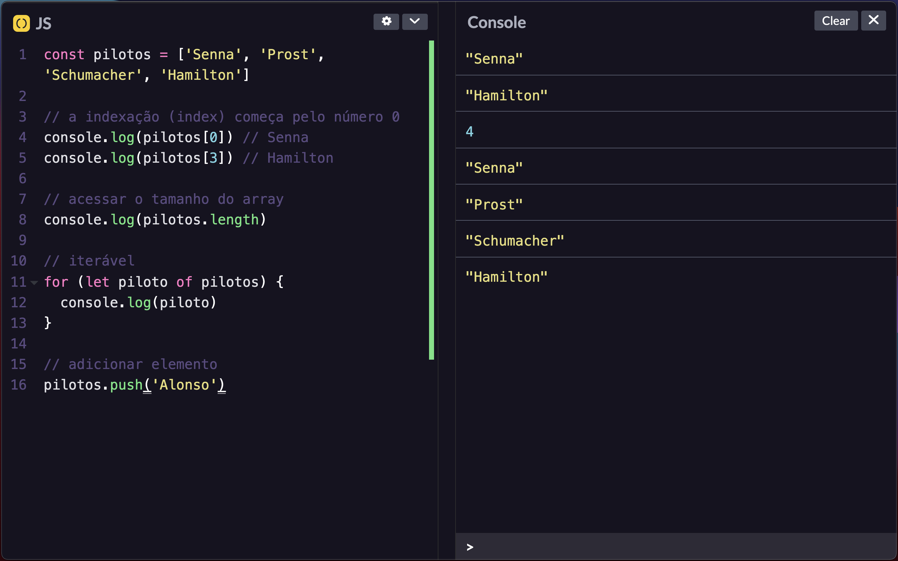

# Electron Omni Codepen.io

With Electron.js, let's inject some CSS to customize Codepen ;)



The preview above are in `zen mode` (only works with JS tab + console).

To toggle it, just press: `Alt+Shift+control+r`

---

## 3 Steps to Use it.

```sh
# 1. Install
npm i

# 2. Build
npm run build

#3. Run your new app.
_It will be at ./packages directory
```

---

## Get more content!

- [Youtube](https://www.youtube.com/maykbrito)
- [maykbrito.dev](https://maykbrito.dev)

---

Please, support with your star 🌟

Thank you 💛
